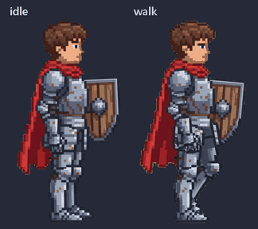
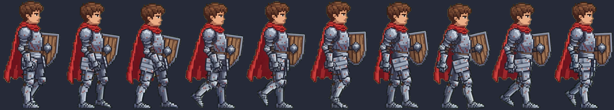
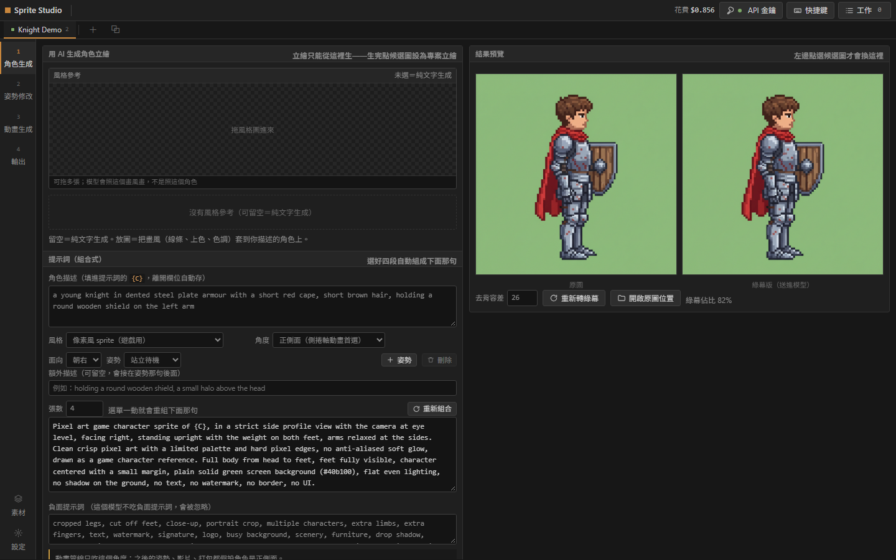
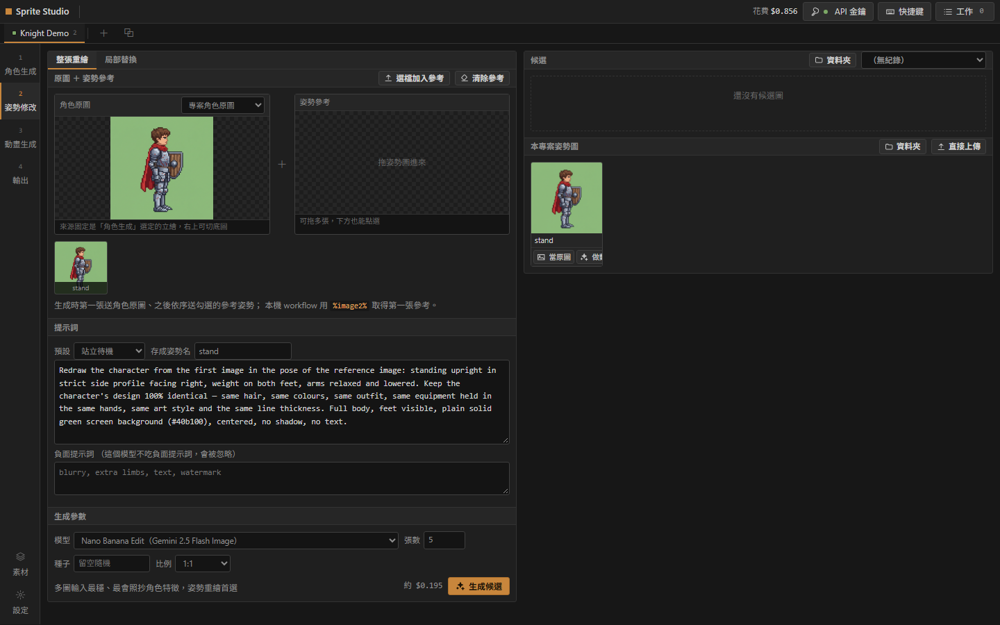
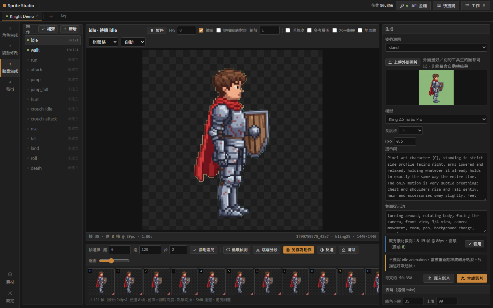
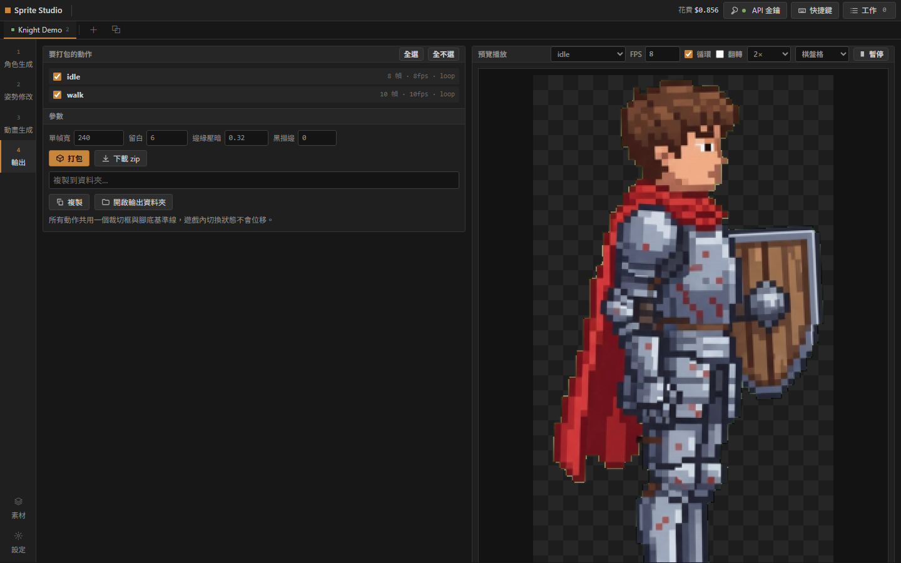
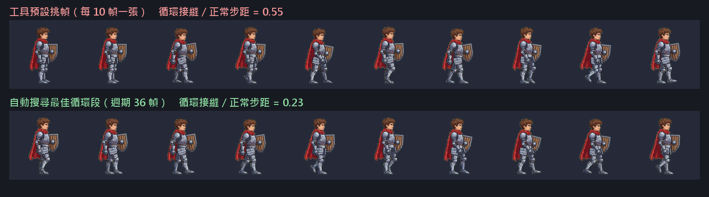

# Sprite Studio

[](https://github.com/philippe8910/sprite-studio/actions/workflows/tests.yml)

**從一張角色立繪，到遊戲可用的 sprite sheet。**
用 AI 生成角色立繪與動作影片，再自動抽幀、去背、找循環、對齊、打包成遊戲素材；
打包後自動評估品質，失敗時依類型分類，只重做壞掉的那一支動作。適用任何 2D 側捲軸角色（不限題材與裝備）。

*From a single character illustration to a game-ready sprite sheet — AI image & video generation,
automatic frame extraction, background removal, loop detection, alignment and packing,
with automatic quality checks so only broken animations get regenerated.*

<p align="center"></p>



> 以上示範角色完全由本工具產生：文字描述 → 4 張立繪候選 → 挑一張 → 生成 idle / walk 影片 → 挑循環段 → 打包。
> 全程花費 **US$0.86**（fal.ai），打包後自動評估 2 / 2 通過。

## 四個步驟

| 1. 角色生成 | 2. 姿勢修改 |
|---|---|
|  |  |
| 組合式提示詞（風格・角度・面向・姿勢）生成立繪候選，挑一張成為專案立繪並自動轉綠幕 | 以立繪為準套用姿勢參考，生成同一角色的不同姿勢，作為各動作影片的起始圖 |
| **3. 動畫生成** | **4. 輸出** |
|  |  |
| 每個動作一張卡：選模型與預設提示詞生成影片，自動抽幀去背；底部膠片挑幀、中央即時播放 | 勾選要打包的動作，產生橫向 strips + `anims.json` + zip，右側直接預覽打包結果 |

```
組合提示詞生立繪 ─► 套姿勢參考生候選 ─► 挑一張
      ─► 套動作預設 ─► 影片生成（fal.ai：Kling / Seedance …，或本機 ComfyUI）
      ─► 抽幀・色鍵去背・循環偵測・腳底對齊 ─► 挑幀（即時預覽）
      ─► 打包 sprite strips + anims.json ─► 自動品質評估 ─► 只重做失敗的動作
```

內建通用動作預設：待機、走、跑、攻擊、跳躍、受傷、蹲姿、翻滾、倒地等，
不假設角色手上拿什麼——裝備寫在角色描述裡即可。

## 重點設計

| 問題 | 做法 | 程式位置 |
|---|---|---|
| 新模型一直上架、參數各不相同 | 執行期向 fal.ai 取模型清單與每個模型的 OpenAPI input schema（清單快取 12 小時、schema 7 天），依 schema 組 payload、鉗制 enum；取不到時退回內建組法。新模型上架不用改程式 | `falcatalog.py` |
| 長時間生成任務 | fal queue 提交 → 輪詢狀態 → 下載結果；金鑰以「查不存在的 request id」零成本驗證（401 / 200） | `falclient.py` |
| 成本看不見 | 每次生成累計花費顯示在右上角；未公布價格的模型顯示「價格未知」而不是 $0 | `server.py`、`static/app.js` |
| 雲端與本機模型並存 | 同一流程可切換 fal.ai 或本機 ComfyUI / A1111 workflow | `localgen.py`、`workflows/` |
| 影片模型會多加火光等特效 | 可選的亮色特效清除；幀縮圖標出疑似特效的幀 | `pipeline.py` |
| 生成品質不穩 | 打包後自動評估，依失敗類型標出要重做的動作（見下） | `tools/eval_sprites.py` |

## 自動品質評估

```bash
python tools/eval_sprites.py <素材資料夾> --json report.json
```

逐個動作檢查：空白幀、連續重複幀（列為人工確認）、循環接縫跳動或停頓、
原地動作的腳底漂移、左右被畫框切到。任何一項不過即判失敗並附上失敗類型。

**實測**：以本管線產出、已上線的網頁遊戲素材 121 個動作 → 通過 109（90.1%），
標出 12 個待修（被畫框切到 8、循環接縫跳動 4）。規則經過抽查修正以排除誤判：
一次性動作（攻擊等）的接縫不算循環跳動、走跑跳類不檢查腳底、倒地角色貼齊下緣不算裁切。

## 自動修復：評估 → 分類 → 只修壞掉的

```bash
POST /api/projects/<pid>/repair   {"optimize_loops": true, "allow_paid": false, "max_paid": 3}
```

打包後自動評估，依失敗類型決定修法，**先做免費的本地修復，修不好才花錢重新生成**，
修完重新打包、再評估一次，前後結果寫進專案的 `repairs.jsonl`。

| 失敗類型 | 修法 | 花費 |
|---|---|---|
| 循環接縫跳動／停頓 | 在整段影片中重新搜尋接縫最小的循環段，重挑幀 | 免費 |
| 腳底漂移 | 開啟腳底對齊 | 免費 |
| 被畫框切到 | 縮小 10% 重新置中 | 免費 |
| 空白幀、幀數不足 | 以新 seed 重新生成影片，並自動挑循環段（需 `allow_paid`，單次最多 `max_paid` 支） | 付費 |

**實測（上方騎士的 walk）**：工具生成影片後的預設挑幀是每 10 幀取一張，
開啟 `optimize_loops` 後自動找到週期 36 幀的循環段，**循環接縫 / 正常步距從 0.55 降到 0.23**，
整個修復 3.6 秒、花費 $0。

> 指標說明：這裡的「循環接縫 / 正常步距」是在**原始影片**的縮小灰階特徵上計算（`repair.best_loop`），用來挑幀；
> `eval_sprites.py` 報告中的 `seam_ratio` 則是對**打包後**的 sprite 逐像素計算（含去背、對齊、縮放），兩者尺度不同、不能直接比較。
> 例如 `examples/knight` 的 walk 在評估報告中 `seam_ratio` 為 0.94（< 2.5 即通過）。



**已知限制**：事後評估的接縫檢查對「側面走路只取半個週期」這類錯誤不敏感——
左右腳互換後輪廓幾乎一樣，接縫看起來很順。實測時漏抓，所以循環段改由 `optimize_loops`
主動搜尋，而不是只靠事後評估；待機這種幾乎靜止的動作，接縫比值因步距趨近 0 而不具參考性。

## 可靠性

| 問題 | 做法 | 程式位置 |
|---|---|---|
| 伺服器重啟，任務狀態消失 | 任務狀態寫入 `data/jobs.json`（暫存檔＋原子替換）；重啟時把未完成的任務標成「中斷」，不會謊報還在跑 | `jobstore.py` |
| 同時送太多請求被限流 | 全域併發上限（預設 4，`FAL_MAX_CONCURRENT` 可調） | `falclient.py` |
| 暫時性錯誤（429 / 5xx / 斷線） | 取結果、下載以指數退避重試；**送出只在 429 時重試**——逾時或 5xx 時 fal 可能已經收下並計費，重送會付兩次錢；輪詢連續失敗 20 次就放棄並回報 request id | `falclient.py` |
| 下載失敗、重啟或並發造成重複付費 | 送出前先以輸入雜湊（模型・提示詞・起始圖・參數）在鎖內佔位，相同請求同時進來只有一個真的送出、其餘等待接回；送出後記下 request id，下載失敗或重啟後接回原請求取結果；已拿到 request id 的請求（已計費）之後無論下載或取結果出什麼錯都保留佔位、下次接回；尚未拿到 request id 時，模型回報失敗或確定被拒才清掉佔位；送出時逾時或 5xx（結果不明、可能已計費）則保留佔位並標記，10 分鐘內不自動重送。錯誤以類型（rejected / uncertain / failed）判斷，不靠比對訊息字串 | `server.py`、`repair.claim / release` |

## 測試

```bash
pip install -r requirements-dev.txt
pytest -q tests                                  # 31 個測試
python tools/eval_sprites.py examples/knight     # 範例素材評估
```

涵蓋評估規則（空白幀、裁切、接縫、腳底、重複幀）、循環搜尋、修復計畫、快取鍵、
重試與退避、送出逾時不重送、生成佔位／接回／失敗釋放、接回既有請求不重送、任務重啟後的狀態。每次 push 由 GitHub Actions 自動執行。
測試寫完後以「故意改壞程式」確認測試真的會失敗。

## 啟動

```bash
pip install -r requirements.txt
cp settings.example.json settings.json     # Windows：copy
python server.py                            # 或雙擊 run.bat
```

開 <http://127.0.0.1:8765>，右上角「API 金鑰」貼上 fal.ai 金鑰（`id:secret`）。
金鑰來源優先序：設定頁 → 環境變數 `FAL_KEY` → 環境變數 `FAL_SECRETS_JSON` 指向的 JSON（`falApiKey` 欄位）。
`settings.json` 與 `data/` 已列入 `.gitignore`，不會被提交。

## 結構

| 檔案 | 用途 |
|---|---|
| `server.py` | Flask 後端：專案、候選圖、影片、抽幀、打包 API |
| `pipeline.py` | 抽幀、色鍵去背、循環偵測、對齊、打包 |
| `falclient.py` / `falcatalog.py` | fal.ai 佇列客戶端與線上模型目錄 |
| `localgen.py` | 本機 ComfyUI / A1111 生成 |
| `presets.py` / `poselib/` | 通用動作提示詞預設與姿勢參考 |
| `gamespec.py` | 從既有遊戲讀取素材慣例（格子大小、腳底錨點） |
| `static/` | 無框架前端（單頁） |
| `tools/eval_sprites.py` | 自動品質評估 |
| `repair.py` | 失敗分類、修復計畫、循環搜尋、生成快取鍵 |
| `jobstore.py` | 任務狀態持久化 |
| `tests/` | pytest 測試 |
| `examples/knight/` | 範例素材與評估報告 |
| `tools/build_mac.py` | 產生 macOS 可攜版 |
| `docs/NOTES_zh.md` | 詳細操作筆記 |

## 開發方式

以 Claude Code 為主要開發夥伴：先定義驗收條件與量測方式，再讓 AI 實作，最後以實際素材與評估工具驗證。
